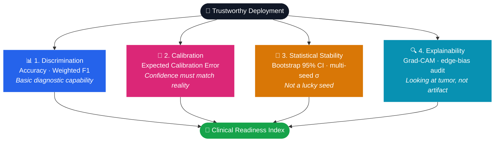
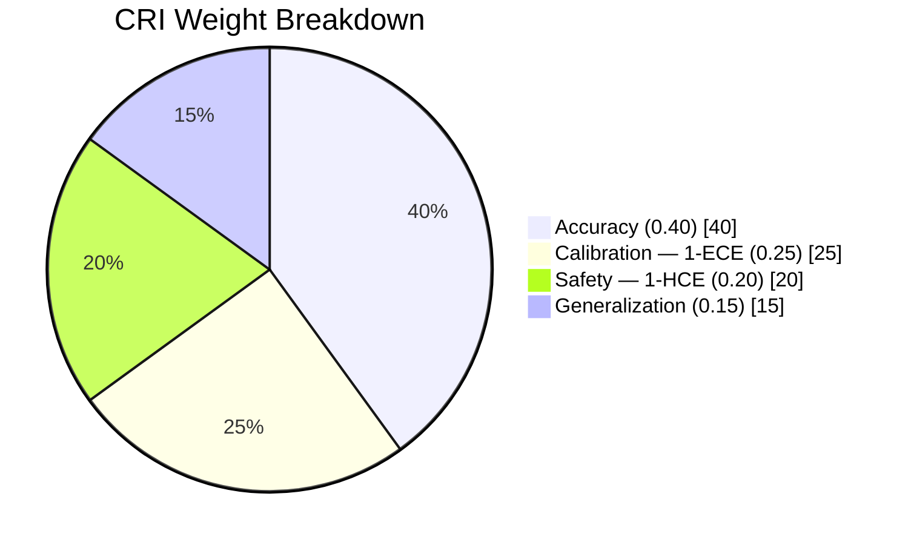
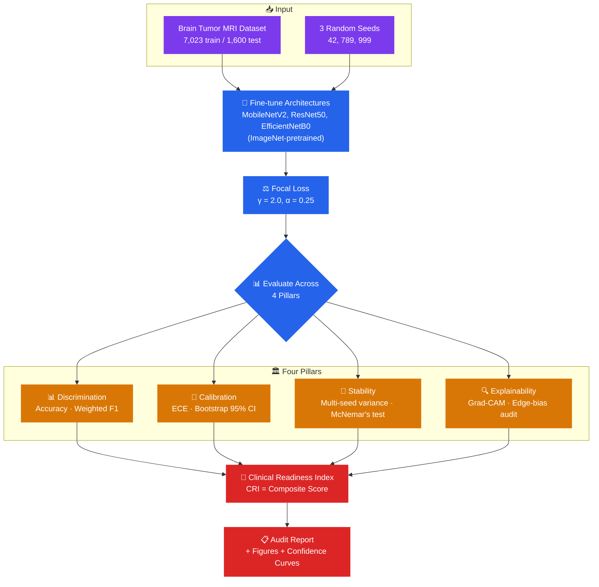
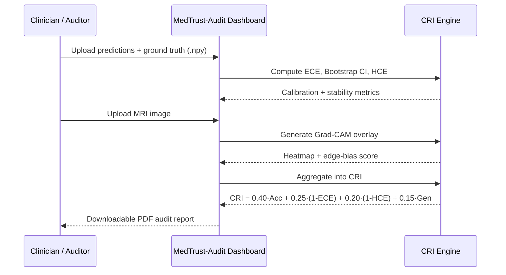

<div align="center">


<br/>

[](#-citation)
[](./LICENSE)
[](#requirements)
[](#requirements)
[](#-reproducing-results)

<br/>


<br/>


**Authors:** Iqra Safdar · Zeeshan Raza · Malaika Arif
**Affiliation:** Department of Computer Science, COMSATS University Islamabad, Sahiwal Campus

</div>

<br/>

## 📋 Table of Contents

- [🔥 The Core Problem](#-the-core-problem)
- [🏛️ The Four Pillars](#️-the-four-pillars)
- [📐 The Clinical Readiness Index (CRI)](#-the-clinical-readiness-index-cri)
- [🔄 Pipeline Overview](#-pipeline-overview)
- [📊 Methodology](#-methodology)
- [📈 Results](#-results)
- [📁 Repository Structure](#-repository-structure)
- [🚀 Reproducing Results](#-reproducing-results)
- [🛠️ The Audit Tool (MedTrust-Audit)](#️-the-audit-tool-medtrust-audit)
- [📚 Citation](#-citation)
- [📄 License](#-license)

<br/>

## 🔥 The Core Problem

Brain tumor MRI classifiers routinely report **94%+ accuracy**. But accuracy alone doesn't tell you whether a model is safe to deploy clinically. Two dangerous failure modes hide behind a good accuracy number:

| Failure Mode | What It Means | Clinical Risk |
|---|---|---|
| 🎯 **Miscalibration** | The model's stated confidence doesn't match its actual reliability | A clinician trusting a 95% confidence score may proceed with wrong treatment |
| ⚠️ **Silent high-confidence errors** | The model is most *wrong* exactly when it claims to be most *sure* | Critical misdiagnoses go unflagged because the model appears "certain" |

> 🚨 **Key Finding:** In our evaluation, **74.12% of MobileNetV2's wrong predictions were made with >90% confidence.** A clinician trusting the model's confidence score to flag uncertain cases would miss **three out of every four errors.**

This is why we propose a framework that doesn't stop at accuracy. We evaluate across **four pillars** and combine them into a single deployment-readiness score: the **Clinical Readiness Index (CRI)**.

<br/>

### ⚡ TL;DR — At a Glance

| | |
|---|---|
| 🏆 **Best Model** | MobileNetV2 — highest CRI despite not having the highest raw accuracy |
| 📊 **Primary Accuracy** | 94.67% (ResNet50) · 94.21% (MobileNetV2) · 94.04% (EfficientNetB0) |
| 🌍 **External Validation** | 86.13% zero-shot on independent Figshare dataset |
| 🚨 **The Catch** | 74.12% of MobileNetV2's errors occur with >90% confidence |
| 📐 **Readiness Score** | CRI = 0.8186 / 1.0 (MobileNetV2) |
| 🔍 **Explainability Audit** | Grad-CAM on all 1,600 test images — caught a watermark-driven artifact in EfficientNetB0 |
| 🧪 **Reproducibility** | 3 seeds, bootstrap 95% CI (10,000 resamples), McNemar's test |

<br/>

## 🏛️ The Four Pillars

We argue that trustworthy deployment requires treating these four dimensions as **equal priorities**, not a hierarchy where accuracy sits alone at the top.

<div align="center">



</div>

> **Gap in Existing Literature:** Table I shows that no prior brain tumor MRI study reports all four pillars together. Our work is the first in the regional neuro-oncological AI literature to do so.

<details>
<summary><b>📋 Table I — Comparison of Evaluation Scope in Recent Brain Tumor MRI Literature</b> (click to expand)</summary>
<br/>

| Study | Architecture | Accuracy | ECE | Bootstrap CI | XAI Audit |
|---|---|---|---|---|---|
| Nickparvar et al. [4] | CNN | ✅ | ❌ | ❌ | ❌ |
| Rehman et al. [5] | Multi | ✅ | ❌ | ❌ | ❌ |
| Swati et al. [13] | EfficientNetB0 | ✅ | ❌ | ❌ | ❌ |
| Cheng et al. [14] | ResNet | ✅ | ❌ | ❌ | ❌ |
| Gumaei et al. [15] | Hybrid | ✅ | ❌ | ❌ | ❌ |
| Sajjad et al. [16] | Multi-CNN | ✅ | ❌ | ❌ | ⚠️ Qualitative only |
| Abiwinanda et al. [17] | CNN | ✅ | ❌ | ❌ | ❌ |
| Gao et al. [31] (SwinBTC) | Swin Transformer | ✅ | ❌ | ❌ | ❌ |
| **This Work** | **MobileNetV2, ResNet50** | ✅ | ✅ | ✅ | ✅ |

✅ = Reported  ❌ = Not Reported  ⚠️ = Partial

</details>

<br/>

## 📐 The Clinical Readiness Index (CRI)

To consolidate multi-pillar assessment into a single procurement metric, we propose the **Clinical Readiness Index (CRI)**:

```
CRI = 0.40 × Accuracy + 0.25 × (1 − ECE) + 0.20 × (1 − HCE) + 0.15 × Generalization
```

<div align="center">



</div>

| Component | Symbol | Description | Weight | Rationale |
|---|---|---|---|---|
| **Accuracy** | `Acc` | Top-1 classification accuracy | 0.40 | Primary discriminative capability |
| **Calibration** | `1 − ECE` | Expected Calibration Error inverted | 0.25 | Confidence must match reality |
| **High-Confidence Reliability** | `1 − HCE` | Fraction of errors with confidence > 0.9 | 0.20 | Silent errors are the most dangerous |
| **Generalization** | `Gen` | External dataset retention (1.0 for primary) | 0.15 | Robustness beyond training distribution |

All components are bounded to **[0, 1]**. The weights reflect clinical priorities: discrimination matters most, but a model with excellent accuracy yet dangerous overconfidence should not receive a high readiness score.

> **Key Insight:** MobileNetV2 achieves CRI = **0.8186** — its readiness is reduced not by accuracy, but by silent high-confidence errors (contributing only 0.0518 of its maximum 0.20 safety weight).

<br/>

## 🔄 Pipeline Overview

<div align="center">



</div>

<br/>

## 📊 Methodology

### Dataset & Preprocessing

| Attribute | Detail |
|---|---|
| **Dataset** | Public Brain Tumor MRI Dataset (Nickparvar et al.) |
| **Training Set** | 7,023 images (naturally imbalanced) |
| **Test Set** | 1,600 images (perfectly balanced: 400 per class) |
| **Classes** | Glioma, Meningioma, Pituitary, No-Tumor |
| **Input Resolution** | 224 × 224 (ImageNet compatible) |
| **Normalization** | ImageNet mean/std statistics |
| **Augmentation** | Rotation (±20°), Shift (±15%), Zoom (±15%), Horizontal Flip, Brightness [0.8, 1.2] |
| **Validation Split** | 20% of training pool (1,405 images) for early stopping |

<div align="center">

<br/><sub><i>Sample MRI images from the dataset across all four classes (Glioma, Meningioma, Pituitary, No-Tumor)</i></sub>
</div>
<br/>

**Dataset Splits:**

| Split | Images | Fraction | Classes |
|---|---|---|---|
| Training (actual) | 5,618 | 80% of train+val pool | 4 |
| Validation | 1,405 | 20% of train+val pool | 4 |
| Test | 1,600 | — | 4 (balanced) |
| **Total** | **8,623** | — | — |

### Focal Loss for Class Imbalance

Standard cross-entropy under-weights challenging positive examples in imbalanced datasets and induces overconfidence on easy negatives — a known precursor to miscalibration. We employ **Focal Loss**:

```
L_FL = −α (1 − pₜ)^γ log(pₜ)
```

With hyperparameters:
- **γ = 2.0** — modulating factor attenuates gradients for easy negatives by up to 16×
- **α = 0.25** — corrects class imbalance

The modulating factor `(1 − pₜ)^γ` concentrates updates on **hard glioma cases** while improving calibration by down-weighting easy negatives.

### Architectures

We evaluate three architectures, all initialized with **ImageNet weights**:

| Architecture | Parameters | Latency (CPU) | Unfrozen Layers | Classification Head |
|---|---|---|---|---|
| **MobileNetV2** | 3.5M | 147.54 ms | Last 50 | Global Avg Pool → BatchNorm → Dense(128, ReLU) → Dropout(0.5) → Dense(4, Softmax) |
| **ResNet50** | 25.6M | ~ higher | Last 50 | Same as above |
| **EfficientNetB0** | 5.3M | ~ medium | Last 50 | Same as above |

> **Consumer-Electronics Readiness:** At 3.5M parameters and 147.54ms CPU-only latency, MobileNetV2 is deployable on edge devices in resource-constrained settings (e.g., rural clinics in Pakistan).

### Training Protocol

| Parameter | Value | Rationale |
|---|---|---|
| Optimizer | Adam | Adaptive learning rate |
| Initial Learning Rate | 10⁻⁴ | Conservative fine-tuning |
| Batch Size | 32 | Memory-efficient |
| Max Epochs | 30 | With early stopping |
| Early Stopping Patience | 10 | Prevents overfitting |
| LR Reduction Factor | 0.5 | Gentle decay |
| LR Patience | 4 epochs | Allows oscillation |
| Dropout Rate | 0.5 | Regularization |
| Random Seed | 42 (primary), 789, 999 | Reproducibility + stability testing |
| Bootstrap Resamples | 10,000 | Standard 95% CI |
| ECE Bins | 10 equal-width | Per Guo et al. [6] |

### Evaluation Protocol

**1. Discrimination:** Top-1 Accuracy · Weighted F1-Score

**2. Calibration** — Expected Calibration Error (ECE) with 10 equal-width bins:

```
          M
ECE = Σ  |Bₘ|/N × |acc(Bₘ) − conf(Bₘ)|
         m=1
```

Where `Bₘ` is the set of predictions in bin *m*, `acc(Bₘ)` is the accuracy of bin *m*, and `conf(Bₘ)` is the average confidence of bin *m*.

**3. Statistical Stability:** Bootstrap 95% confidence intervals from **10,000 resamples** · Multi-seed variance (σ) across seeds {42, 789, 999} · Instance-wise pairing preserved between ground truth and predictions

**4. Explainability:** **Grad-CAM** heatmaps for **all 1,600 test images** (not a hand-picked subset) · Quantified via **edge-bias metric**: activation mass within a 20-pixel border · Detects artifact exploitation (watermarks, corner markers, skull-edge intensity)

### Ensemble & Post-Hoc Calibration

| Step | Method | Details |
|---|---|---|
| **Weighted Ensemble** | Grid search over λ ∈ [0.1, 0.9] | MobileNetV2 weight = λ, ResNet50 weight = 1 − λ |
| **Complementarity Test** | McNemar's exact test [26,27] | Assesses statistically significant complementary error patterns on discordant counts n₀₁ and n₁₀ |
| **Temperature Scaling** | Post-hoc calibration [6] | `qᵢ = exp(zᵢ/T) / Σⱼ exp(zⱼ/T)` with T ∈ [0.5, 5.0] chosen to minimize ECE |

<details>
<summary><b>🧮 Algorithm 1: Multi-Pillar Clinical Trust Framework</b> (click to expand pseudocode)</summary>
<br/>

```
┌─────────────────────────────────────────────────────────────────────┐
│  ALGORITHM 1: Multi-Pillar Clinical Trust Framework               │
├─────────────────────────────────────────────────────────────────────┤
│  INPUT:  Dataset D, Model M, Seeds S = {42, 789, 999}            │
│  OUTPUT: Trained M*, CRI, ECE, HCE, Audit Report                  │
├─────────────────────────────────────────────────────────────────────┤
│  1:  PREPROCESS: Resize → 224×224, Normalize (ImageNet stats),     │
│      Augment (rotation, shift, zoom, flip, brightness)            │
│                                                                     │
│  2:  SPLIT D → Train (80%), Val (20%), Test (1,600)               │
│                                                                     │
│  3:  for each seed s ∈ S do                                        │
│  4:      LOAD M with ImageNet weights                              │
│  5:      UNFREEZE last 50 layers                                   │
│  6:      TRAIN with Focal Loss (γ=2.0, α=0.25), Adam (lr=1e-4)    │
│  7:      EVALUATE Discrimination: Accuracy, Weighted F1           │
│  8:      EVALUATE Calibration: ECE with 10 equal-width bins        │
│  9:      EVALUATE Stability: Bootstrap 95% CI (10,000 resamples)  │
│ 10:      EVALUATE Explainability: Grad-CAM heatmaps; edge-bias    │
│                                                                     │
│ 11:  BUILD weighted ensemble: Grid-search λ ∈ [0.1, 0.9]          │
│ 12:  TEST complementarity: McNemar's exact test                    │
│ 13:  APPLY temperature scaling: T ∈ [0.5, 5.0] to minimize ECE    │
│                                                                     │
│ 14:  COMPUTE CRI = 0.40·Acc + 0.25·(1−ECE) + 0.20·(1−HCE)        │
│                    + 0.15·Gen                                      │
│                                                                     │
│ 15:  RETURN M*, CRI, ECE, HCE, Audit Report                       │
└─────────────────────────────────────────────────────────────────────┘
```

</details>

<br/>

## 📈 Results

### Discriminative Performance

Results on the main test set (n = 1,600) across three random seeds:

#### Table V — Multi-Seed Discriminative Performance and Stability

| Model | Accuracy | Weighted F1 | Range (Min–Max) | Std Dev (σ) |
|---|---|---|---|---|
| **ResNet50** | 🥇 **94.67% ± 0.12%** | 94.55% ± 0.13% | [94.44%, 94.79%] | 0.12% |
| **MobileNetV2** | 🥈 94.21% ± 0.21% | 94.08% ± 0.21% | [94.00%, 94.50%] | 0.21% |
| **EfficientNetB0** | 🥉 94.04% ± 0.61% | 93.92% ± 0.53% | [93.69%, 94.75%] | 0.61% |

**Observations:**
- ResNet50 shows the most robust convergence (lowest σ = 0.12%)
- MobileNetV2 achieves near-equivalent performance at **7× fewer parameters**
- EfficientNetB0 exhibits the highest seed sensitivity (σ = 0.61%), suggesting less stable training

> **Context:** Gao et al. [31] (SwinBTC) reported 96.4% accuracy on the same task but evaluated **none** of the other pillars — no calibration, no confidence intervals, no spatial bias audit. Our MobileNetV2 sits in the same accuracy ballpark while providing full clinical safety diagnostics.

<div align="center">

```mermaid
quadrantChart
    title Accuracy vs. Clinical Readiness (CRI*)
    x-axis Lower Accuracy --> Higher Accuracy
    y-axis Lower Readiness --> Higher Readiness
    quadrant-1 Ideal: accurate & ready
    quadrant-2 Ready, room to grow on accuracy
    quadrant-3 Needs work on both fronts
    quadrant-4 Accurate but not yet ready
    MobileNetV2: [0.55, 0.92]
    ResNet50: [0.90, 0.55]
    EfficientNetB0: [0.20, 0.45]
```

*ResNet50 and EfficientNetB0 CRI values are partial (HCE not yet computed for these — see Table VIII).*

</div>

### Calibration & Confidence Safety

#### Table VI — Calibration and Confidence Safety Metrics (Seed 42)

| Model | Accuracy | ECE | 95% Bootstrap CI | HCE Rate |
|---|---|---|---|---|
| **MobileNetV2** | 94.69% | 0.0479 | [93.56%, 95.75%] | 🚨 **74.12%** |
| **ResNet50** | 94.69% | 0.0432 | — | — |
| **EfficientNetB0** | 93.69% | 0.0427 | — | — |

**Critical Finding:** Although overall ECE stays below 0.05 (well-calibrated in aggregate), the **High-Confidence Error (HCE) rate of 74.12%** reveals a critical deployment risk:

> **Three-quarters of MobileNetV2's errors occur with confidence exceeding 90%.** This severely limits the utility of confidence thresholding for error flagging in clinical practice.

**Confidence Distribution:**

```
Density
  │
100┤                              ████ Correct
  │                              ████
 80┤                              ████
  │                              ████
 60┤                              ████
  │                              ████
 40┤                              ████
  │                              ████
 20┤    ██                       ████ ██ Incorrect
  │    ██                       ████ ██
  0┼────██──────────────────────████─██──────────
   0.5  0.6  0.7  0.8  0.9  │  0.95  1.0
                            0.9
                         (threshold)
```

The vast majority of correct predictions cluster near confidence = 1.0, but incorrect predictions also spike in the same region — this is the **silent failure** pattern.

### Per-Class Performance

#### Table VII — Per-Class Discriminative Performance (MobileNetV2, Seed 42)

| Class | Precision | Recall | F1-Score | 95% Bootstrap CI |
|---|---|---|---|---|
| **Glioma** | 0.892 | ⚠️ **0.880** | 0.886 | **[79.26%, 86.58%]** |
| Meningioma | 0.951 | 0.958 | 0.954 | [93.25%, 97.75%] |
| Pituitary | 0.985 | 0.990 | 0.988 | [98.69%, 100.00%] |
| No-Tumor | 0.972 | 0.965 | 0.968 | [98.69%, 100.00%] |

**Primary Safety Concern:** Glioma shows the lowest recall (0.880) and the widest confidence interval, indicating it is the hardest class to classify correctly. The confusion matrix confirms **glioma misclassified as meningioma (48/400 cases)** as the dominant error mode.

#### Confusion Matrix — MobileNetV2 (Primary Dataset, n=1,600)

```
                    PREDICTED
              Glioma  Meningioma  No-Tumor  Pituitary
           ┌─────────┬─────────┬─────────┬─────────┐
    Glioma │  ✅330   │    48   │    12   │    10   │
           ├─────────┼─────────┼─────────┼─────────┤
Meningioma │    1    │  ✅391   │    0    │    8    │
           ├─────────┼─────────┼─────────┼─────────┤
  No-Tumor │    0    │    1    │  ✅399   │    0    │
           ├─────────┼─────────┼─────────┼─────────┤
  Pituitary│    1    │    2    │    0    │  ✅397   │
           └─────────┴─────────┴─────────┴─────────┘
```

### Explainability & Spatial Bias

Grad-CAM heatmaps were generated for **all 1,600 test images** (not a cherry-picked subset).

<div align="center">

<br/><sub><i>Grad-CAM attention heatmaps — comparing where MobileNetV2, ResNet50, and EfficientNetB0 focus their attention</i></sub>
</div>
<br/>

**Key Findings:**
1. **Architecture-dependent localization:** Attention patterns vary significantly across MobileNetV2, ResNet50, and EfficientNetB0
2. **No model exhibits uniformly anatomically plausible attention**
3. 🚨 **Artifact Detection:** EfficientNetB0 concentrated activation on a **source watermark** in no-tumor images — a non-anatomical artifact correlated with the negative class

This validates **quantitative spatial bias auditing** as a mandatory complement to qualitative explainability. Manual selection of "good-looking" examples would have missed this artifact exploitation entirely.

**Edge-Bias Metric:** Activation mass within a 20-pixel border was computed per class. High edge-bias indicates the model may be attending to scanner artifacts, corner markers, or skull-edge intensity rather than pathological tissue.

### Clinical Readiness Index Scores

#### Table VIII — Clinical Readiness Index (CRI) Synthesis

| Configuration | Acc (0.40) | Cal (0.25) | Safety (0.20) | Gen (0.15) | **CRI** |
|---|---|---|---|---|---|
| **MobileNetV2** | 0.3788 | 0.2380 | 0.0518 | 0.1500 | 🏆 **0.8186** |
| ResNet50 | 0.3788 | 0.2392 | — | 0.1500 | 0.7680* |
| EfficientNetB0 | 0.3748 | 0.2393 | — | 0.1500 | 0.7641* |

*\*Partial CRI — HCE not yet computed for these configurations.*

**Interpretation:**
- MobileNetV2 achieves the **highest CRI (0.8186)** despite not having the highest raw accuracy
- The **Safety pillar contributes only 0.0518** of its maximum 0.20 weight — confirming that silent high-confidence errors remain the dominant barrier to clinical readiness
- Even with excellent accuracy and calibration, the HCE rate drags down the overall readiness score

### Cross-Dataset Generalization

| Metric | Value |
|---|---|
| External Dataset | Figshare (n = 3,064) |
| Zero-Shot Accuracy | **86.13%** |
| Accuracy Drop | −8.08 percentage points |
| Domain Shift | Moderate (same modality, excludes no-tumor class) |

The 8.08% cross-dataset gap defines the current generalization boundary. While smaller than the 20–30% cross-scanner drops reported in broader radiology AI, it represents **partial rather than universal generalization** and motivates multi-center external validation.

<br/>

## 📁 Repository Structure

```
brain-tumor-clinical-trust-framework/
│
├── 📄 README.md                          # This file
├── 📄 LICENSE                            # MIT License
├── 📄 requirements.txt                   # Python dependencies
│
├── 🔧 train_mobilenetv2_paper_exact.py  # Training script matching paper protocol
├── 🔧 train_resnet50_paper_exact.py     # ResNet50 training script
├── 🔧 train_efficientnetb0.py           # EfficientNetB0 training script
│
├── 🔍 generate_gradcam.py                # Grad-CAM heatmap generation (all 1,600 test images)
├── 🔍 spatial_bias_audit.py             # Edge-bias metric computation
│
├── 📊 compute_ece.py                     # Expected Calibration Error calculator
├── 📊 bootstrap_ci.py                    # Bootstrap 95% confidence intervals (10,000 resamples)
├── 📊 mcnemar_test.py                    # McNemar's exact test for ensemble complementarity
│
├── 🌡️ temperature_scaling.py            # Post-hoc calibration via temperature scaling
├── 🧪 generalization_test.py            # Cross-dataset (Figshare) zero-shot evaluation
│
├── 🛠️ medtrust_audit/                    # FastAPI dashboard for clinical auditing
│   ├── main.py
│   ├── cri_calculator.py
│   ├── gradcam_module.py
│   └── templates/
│
└── 📁 outputs/                            # Generated artifacts (not in repo)
    ├── models/                           # Saved model checkpoints
    ├── figures/                          # Grad-CAM overlays, confidence curves
    ├── y_true.npy                        # Ground truth labels
    ├── y_pred.npy                        # Predicted labels
    └── y_pred_probs.npy                  # Predicted probabilities
```

<br/>

## 🚀 Reproducing Results

### Quick Start

```bash
# 1. Clone the repository
git clone https://github.com/iqrasafdarr/Toward-Trustworthy-AI-for-Brain-Tumor-MRI-Classification-A-Multi-Pillar-Clinical-Readiness-Framework.git
cd Toward-Trustworthy-AI-for-Brain-Tumor-MRI-Classification-A-Multi-Pillar-Clinical-Readiness-Framework

# 2. Install dependencies
pip install -r requirements.txt

# 3. Download the Brain Tumor MRI Dataset
#    Source: https://www.kaggle.com/datasets/masoudnickparvar/brain-tumor-mri-dataset
#    Place in: ./data/brain-tumor-mri-dataset/

# 4. Run training (GPU recommended — Colab/Kaggle notebooks work well)
python train_mobilenetv2_paper_exact.py

# 5. Generate Grad-CAM heatmaps for all test images
python generate_gradcam.py --model ./outputs/models/mobilenetv2_seed42.h5 --all-test

# 6. Compute CRI and all pillar metrics
python compute_ece.py --preds ./outputs/y_pred_probs.npy --labels ./outputs/y_true.npy
python bootstrap_ci.py --preds ./outputs/y_pred.npy --labels ./outputs/y_true.npy
python spatial_bias_audit.py --heatmaps ./outputs/figures/gradcam/
```

### Requirements

```
tensorflow>=2.10.0
numpy>=1.21.0
matplotlib>=3.5.0
seaborn>=0.11.0
scikit-learn>=1.0.0
scipy>=1.7.0
opencv-python>=4.5.0
fastapi>=0.85.0
uvicorn>=0.18.0
pillow>=9.0.0
tqdm>=4.62.0
```

### Reproducibility Note

> Independent reruns of this protocol will not reproduce the paper's exact figures to the decimal. **Table V** documents seed-to-seed variance as an expected, normal property of the training process — not an error. The σ values quantify this variance explicitly. For exact reproduction, use the reported seeds {42, 789, 999}.

<br/>

## 🛠️ The Audit Tool (MedTrust-Audit)

This framework isn't just a paper — it's implemented as a runnable auditing tool.

**MedTrust-Audit** is a FastAPI dashboard that:
- Computes the **CRI** and all four pillars directly from saved predictions
- Generates **Grad-CAM explainability overlays** with a single upload
- Supports auditing **externally-provided prediction arrays** (`.npy` format)
- Produces downloadable **PDF audit reports** for clinical procurement teams

### Launch the Dashboard

```bash
cd medtrust_audit
uvicorn main:app --reload
# Navigate to http://localhost:8000
```

### API Endpoints

| Endpoint | Method | Description |
|---|---|---|
| `/upload` | POST | Upload model predictions + ground truth |
| `/cri` | GET | Compute Clinical Readiness Index |
| `/calibration` | GET | ECE curve + reliability diagram |
| `/gradcam` | POST | Generate Grad-CAM for uploaded image |
| `/report` | GET | Download full PDF audit report |

<div align="center">



</div>

<br/>

## 📚 Citation

If you use this framework or find our work valuable, please cite:

```bibtex
@unpublished{safdar2026beyond,
  title   = {Beyond Accuracy: A Multi-Pillar Clinical Trust Framework for Brain Tumor MRI Classification},
  author  = {Safdar, Iqra and Raza, Zeeshan and Arif, Malaika},
  note    = {Under review},
  year    = {2026},
  institution = {COMSATS University Islamabad, Sahiwal Campus}
}
```

### Related Work Referenced

| Citation | Contribution |
|---|---|
| Guo et al. [6] | Expected Calibration Error (ECE); temperature scaling |
| Lin et al. [8] | Focal Loss for dense object detection |
| Mukhoti et al. [20] | Focal loss improves calibration in imbalanced classification |
| Selvaraju et al. [21] | Grad-CAM: gradient-based localization |
| Ghorai et al. [22] | Quantitative artifact-driven attention audit |
| McNemar [26] / Dietterich [27] | Statistical testing for classifier comparison |

<br/>

## 📄 License

This project is licensed under the **MIT License** — feel free to use, modify, and distribute as needed.

```
MIT License

Copyright (c) 2026 Iqra Safdar, Zeeshan Raza, Malaika Arif

Permission is hereby granted, free of charge, to any person obtaining a copy
of this software and associated documentation files (the "Software"), to deal
in the Software without restriction, including without limitation the rights
to use, copy, modify, merge, publish, distribute, sublicense, and/or sell
copies of the Software, and to permit persons to whom the Software is
furnished to do so, subject to the following conditions:

The above copyright notice and this permission notice shall be included in all
copies or substantial portions of the Software.
```

<br/>

## 🤝 Acknowledgments

The authors acknowledge **COMSATS University Islamabad** for computational resources and the curators of the public brain tumor MRI datasets used in this study.

<div align="center">

**⭐ Star this repo if you find it useful!**

*Built with ❤️ at COMSATS University Islamabad, Sahiwal Campus*


</div>
